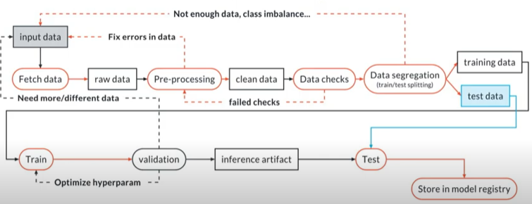
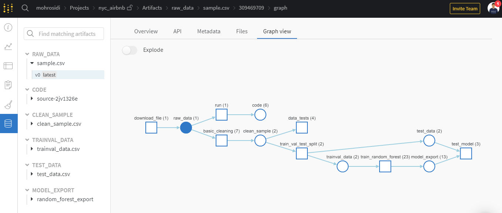

# Build an ML Pipeline for Short-Term Rental Prices in NYC

``` Project **Build an ML Pipeline for Short-Term Rental Prices in NYC** Churn of ML DevOps Engineer Nanodegree Udacity```

You are working for a property management company renting rooms and properties for short periods of 
time on various rental platforms. You need to estimate the typical price for a given property based 
on the price of similar properties. Your company receives new data in bulk every week. The model needs 
to be retrained with the same cadence, necessitating an end-to-end pipeline that can be reused.

For this project, we will build ML Pipeline to perform a number of processes< such as: downloading the required datasets, doing basic celaning, checking based on assumptions on data, training, and testing. The pipeline built for this project is very simple and allows it to be upgraded in the future.



## Table of contents

- [Introduction](#build-an-ML-Pipeline-for-Short-Term-Rental-Prices-in-NYC)
- [Repository structure](#repository-structure)
- [How to use it](#how-to-use-it)
  * [Dependency](#dependency)
  * [Clone the project](#clone-the-project)
  * [Create environment](#create-environment)
  * [Get API key for Weights and Biases](#get-api-key-for-weights-and-biases)
  * [Cookie cutter](#cookie-cutter)
  * [The configuration](#the-configuration)
  * [Running the entire pipeline or just a selection of steps](#Running-the-entire-pipeline-or-just-a-selection-of-steps)
  * [Run existing pipeline](#run-existing-pipeline)
- [In case of errors](#in-case-of-errors)
- [Development plans](#development-plans)

## Repository structure

The repository contains a number of modules that are then executed using MLFlow. The modules are stored in two folders, namely: `components` and `src`. 

The components folder contains modules for downloading data, testing regression models, and data segregation. The src folder contains modules for basic celaning, data check, EDA, and random forest training. Each module will be equipped with two files, namely: `conda.yml` for conda environment configuration and `MLproject` for module MLflow configuration. 

The main.py file will combine all of these modules into a training and testing pipeline. The logging process for each step is done using W&B. The parameters used for each module are saved into the config.yaml file. The file contains configurations for basic cleaning to training random forest.

>
NOTE: Each module needs to be set with the conda.yaml and MLproject files

```
.
├── LICENSE
├── LICENSE.txt
├── MLproject
├── README.md
├── components
│   ├── README.md
│   ├── conda.yml
│   ├── get_data
│   │   ├── MLproject
│   │   ├── conda.yml
│   │   ├── data
│   │   │   ├── sample1.csv
│   │   │   └── sample2.csv
│   │   └── run.py
│   ├── setup.py
│   ├── test_regression_model
│   │   ├── MLproject
│   │   ├── conda.yml
│   │   └── run.py
│   └── train_val_test_split
│       ├── MLproject
│       ├── conda.yml
│       └── run.py
├── conda.yml
├── config.yaml
├── cookie-mlflow-step
│   ├── README.md
│   ├── cookiecutter.json
│   └── {{cookiecutter.step_name}}
│       ├── MLproject
│       ├── conda.yml
│       └── {{cookiecutter.script_name}}
├── environment.yml
|
|...
|
├── main.py
|
|...
|
└── src
    ├── basic_cleaning
    │   ├── MLproject
    │   ├── artifacts
    │   │   └── sample.csv:v0
    │   │       └── sample1.csv
    │   ├── conda.yml
    │   └── run.py
    ├── data_check
    │   ├── MLproject
    │   ├── __pycache__
    │   │   ├── conftest.cpython-39-pytest-6.2.2.pyc
    │   │   └── test_data.cpython-39-pytest-6.2.2.pyc
    │   ├── artifacts
    │   │   ├── clean_sample.csv:v0
    │   │   │   └── clean_sample.csv
    │   │   └── clean_sample.csv:v1
    │   │       └── clean_sample.csv
    │   ├── conda.yml
    │   ├── conftest.py
    │   └── test_data.py
    ├── eda
    │   ├── EDA.ipynb
    │   ├── MLproject
    │   ├── artifacts
    │   │   └── sample.csv:v0
    │   │       └── sample1.csv
    │   └── conda.yml
    └── train_random_forest
        ├── MLproject
        ├── artifacts
        │   ├── trainval_data.csv:v0
        │   │   └── tmp9cq0zk5j
        │   └── trainval_data.csv:v1
        │       └── tmpu7lq_jd4
        ├── conda.yml
        ├── feature_engineering.py
        └── run.py
```

## How to use it

In this section, we will discuss how to modify a project or run an existing pipeline.

### Dependency

```
dependencies:
  - mlflow=1.14.1
  - ipython=7.21.0
  - notebook=6.2.0
  - jupyterlab=3.0.10
  - cookiecutter=1.7.2
  - hydra-core=1.0.6
  - matplotlib=3.3.4
  - pandas=1.2.3
  - git=2.30.2
  - pip=20.3.3
  - pip:
      - wandb==0.10.31
```

### Clone the project
Go to [nyc_airbnb_dev repository](https://github.com/mohrosidi/nyc_airbnb_dev)
and click on `Fork` in the upper right corner. This will create a fork in your Github account, i.e., a copy of the
repository that is under your control. Now clone the repository locally so you can start working on it:

```
git clone https://github.com/[your_github_username]/nyc_airbnb_dev.git
```

and go into the repository:

```
cd nyc_airbnb_dev
```
Commit and push to the repository often while you make progress towards the solution. Remember 
to add meaningful commit messages.

### Create environment
Make sure to have conda installed and ready, then create a new environment using the ``environment.yml``
file provided in the root of the repository and activate it. This file contain list of module needed to run the project:

```bash
> conda env create -f environment.yml
> conda activate nyc_airbnb_dev
```

### Get API key for Weights and Biases
Let's make sure we are logged in to Weights & Biases. Get your API key from W&B by going to 
[https://wandb.ai/authorize](https://wandb.ai/authorize) and click on the + icon (copy to clipboard), 
then paste your key into this command:

```bash
> wandb login [your API key]
```

You should see a message similar to:
```
wandb: Appending key for api.wandb.ai to your netrc file: /home/[your username]/.netrc
```

### Cookie cutter
In order to make your job a little easier, you are provided a cookie cutter template that you can use to create 
stubs for new pipeline components (ex: add processing pipeline). Run the cookiecutter and enter the required information, and a new component 
will be created including the `conda.yml` file, the `MLproject` file as well as the script. You can then modify these
as needed, instead of starting from scratch.
For example:

```bash
> cookiecutter cookie-mlflow-step -o src

step_name [step_name]: basic_cleaning
script_name [run.py]: run.py
job_type [my_step]: basic_cleaning
short_description [My step]: This steps cleans the data
long_description [An example of a step using MLflow and Weights & Biases]: Performs basic cleaning on the data and save the results in Weights & Biases
parameters [parameter1,parameter2]: parameter1,parameter2,parameter3
```

This will create a step called ``basic_cleaning`` under the directory ``src`` with the following structure:

```bash
> ls src/basic_cleaning/
conda.yml  MLproject  run.py
```

You can now modify the script (``run.py``), the conda environment (``conda.yml``) and the project definition 
(``MLproject``) as you please.

The script ``run.py`` will receive the input parameters ``parameter1``, ``parameter2``,
``parameter3`` and it will be called like:

```bash
> mlflow run src/step_name -P parameter1=1 -P parameter2=2 -P parameter3="test"
```

### The configuration
The parameters controlling the pipeline are defined in the ``config.yaml`` file defined in
the root of the repository. We will use Hydra to manage this configuration file. 

Open this file and get familiar with its content. Remember: this file is only read by the ``main.py`` script 
(i.e., the pipeline) and its content is
available with the ``go`` function in ``main.py`` as the ``config`` dictionary. For example,
the name of the project is contained in the ``project_name`` key under the ``main`` section in
the configuration file. It can be accessed from the ``go`` function as 
``config["main"]["project_name"]``.

>NOTE: do NOT hardcode any parameter when writing the pipeline. All the parameters should be 
accessed from the configuration file.

### Running the entire pipeline or just a selection of steps
In order to run the pipeline when you are developing, you need to be in the root of the repository, 
then you can execute this command:

```bash
>  mlflow run .
```
This will run the entire pipeline.

If you want to run a certain steps you can use the examples of command bellow:

```bash
> mlflow run . -P steps=download
```
This is useful for testing whether steps that have been added or developed can be performed or not.

If you want to run multiple steps (ex:  ``download`` and the ``basic_cleaning`` steps), you can similarly do:
```bash
> mlflow run . -P steps=download,basic_cleaning
```
> NOTE: Make sure the previous artifact step is available in W&B. Otherwise we recommend running each step in order.

You can override any other parameter in the configuration file using the Hydra syntax, by
providing it as a ``hydra_options`` parameter. For example, say that we want to set the parameter
modeling -> random_forest -> n_estimators to 10 and etl->min_price to 50:

```bash
> mlflow run . \
  -P steps=download,basic_cleaning \
  -P hydra_options="modeling.random_forest.n_estimators=10 etl.min_price=50"
```

### Run existing pipeline

We can directly use the existing pipeline to do the training process without the need to fork the repository. All it takes to do that is to conda environment with MLflow and wandb already installed and configured. To do so, all we have to do is run the following command:

```bash
mlflow run -v [pipeline_version] https://github.com/mohrosidi/nyc_airbnb_dev.git
```

`[pipeline_version]` is a release version of the pipeline. For example this repository has currently been released for version `1.0.2`. So we need to input `1.0.2` in place of `[pipeline_version]`.

Suppose we want to change the training random forest parameters can also be done by rewriting the configuration parameters using hydra.

```bash
mlflow run -v 1.0.2 \
  https://github.com/mohrosidi/nyc_airbnb_dev.git \
  -P steps=train_random_forest \
  -P hydra_options="modeling.random_forest.max_depth=10 modeling.random_forest.n_estimators=100 -m"
```

We have successfully run the pipeline, we can see that in the W&B account there is a new project with the name 'nyc_airbnb_dev'. Step running pipelines can be seen in the artifact section of Graph View.



## In case of errors
When you make an error writing your `conda.yml` file, you might end up with an environment for the pipeline or one
of the components that is corrupted. Most of the time `mlflow` realizes that and creates a new one every time you try
to fix the problem. However, sometimes this does not happen, especially if the problem was in the `pip` dependencies.
In that case, you might want to clean up all conda environments created by `mlflow` and try again. In order to do so,
you can get a list of the environments you are about to remove by executing:

```
> conda info --envs | grep mlflow | cut -f1 -d" "
```

If you are ok with that list, execute this command to clean them up:

**_NOTE_**: this will remove *ALL* the environments with a name starting with `mlflow`. Use at your own risk

```
> for e in $(conda info --envs | grep mlflow | cut -f1 -d" "); do conda uninstall --name $e --all -y;done
```

This will iterate over all the environments created by `mlflow` and remove them.

## Development plans

This project is not perfect. Development remains to be done. There are a few things to try in the future.

- Try another algorithm (ex: deep learning)
- Training using AutoML (ex:H2O and pycaret)

Discussions and feedback we highly expect from users and readers
